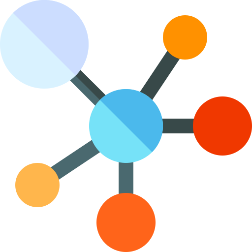

# welcome Dlang $$ kit $$

1. Chip Directory
2. Business Tails
3. perl6
4. upload coward next 

Editor server Dlang kit with Perl6
----------

----------
$ software please $

- graphic
- plots
- kit


*home*

Elementary Operations
The algebraic method for solving systems of linear equations is described as follows. Two such systems
are said to be equivalent if they have the same set of solutions. A system is solved by writing a series of
systems, one after the other, each equivalent to the previous system. Each of these systems has the same
set of solutions as the original one; the aim is to end up with a system that is easy to solve. Each system
in the series is obtained from the preceding system by a simple manipulation chosen so that it does not
change the set of solutions.
As an illustration, we solve the system x + 2y = −2, 2x + y = 7 in this manner. At each stage, the
corresponding augmented matrix is displayed. The original system is
First, subtract twice the first equation from the second. The resulting system is
which is equivalent to the original (see Theorem 1.1.1). At this stage we obtain y = − 11
the second equation by − 3 . The result is the equivalent system
Finally, we subtract twice the second equation from the first to get another equivalent system.
Now this system is easy to solve! And because it is equivalent to the original system, it provides the
solution to that system.
Observe that, at each stage, a certain operation is performed on the system (and thus on the augmented
matrix) to produce an equivalent system.

[!chipDirectory]("https://dlang.org/library/std/file/mkdir.html")
[!bussinesTails]("https://dlang.org/orgs-using-d.html")
[!raku]("https://raku.org/")

manipulation
```dlang
/* of three equations in four variables. The array of numbers1
occurring in the system is called the augmented matrix of the system. Each row of the matrix consists
of the coefficients of the variables (in order) from the corresponding equation, together with the constant
1 A rectangular array of numbers is called a matrix. Matrices will be discussed in more detail in Chapter 2.
*/
void main(string[] args)
{
    class Ps5
    {
        void matrix(number, row, col)(ref coefy)
        {
            int number = 1;
            int row = 80;
            int col = 90;
        }

        void warefiles(number, row, col)(ref coefy)
        {
            auto number = float 27.4;
            assert(!number.float)

            number.float(27.4*10);
            number.float(27.4*40);
        }

        void springRest(number, row, col)(ref coefy)
        {
            uint number = 27;
            uint row = 80;
            uint col = 90;
        }
    }

}

```
preceding


writing

1. BackHelp
2. historySnapDlang
3. dHelp

linear


[!BackHelp]("https://dlang.org/library/std/range/primitives/back.html")
[!historySnapDlang]("https://snapcraft.io/publisher/dlang")
[!dHelp]("https://tour.dlang.org/")


