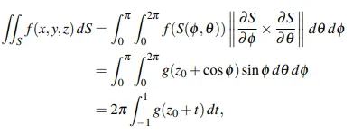

# welcome Dlang $$ kit $$

1. broth clock
2. coward next
3. find
4. launch 
5. quest put
6. sleep
7. upload

Editor server Dlang kit with Perl6
----------

----------
$ software please $

- graphic
- plots
- kit
- perl6
- dlang kit
- chemical
- physic
- math

*home*

> Elementary Operations

The algebraic method for solving systems of linear equations is described as follows. Two such systems
are said to be equivalent if they have the same set of solutions. A system is solved by writing a series of
systems, one after the other, each equivalent to the previous system. Each of these systems has the same
set of solutions as the original one; the aim is to end up with a system that is easy to solve. Each system
in the series is obtained from the preceding system by a simple manipulation chosen so that it does not
change the set of solutions.
As an illustration, we solve the system x + 2y = −2, 2x + y = 7 in this manner. At each stage, the
corresponding augmented matrix is displayed. The original system is
First, subtract twice the first equation from the second. The resulting system is
which is equivalent to the original (see Theorem 1.1.1). At this stage we obtain y = − 11
the second equation by − 3 . The result is the equivalent system
Finally, we subtract twice the second equation from the first to get another equivalent system.
Now this system is easy to solve! And because it is equivalent to the original system, it provides the
solution to that system.
Observe that, at each stage, a certain operation is performed on the system (and thus on the augmented
matrix) to produce an equivalent system.


[chipDirectory]("https://dlang.org/library/std/file/mkdir.html")

[businessTails]("https://dlang.org/orgs-using-d.html")

[raku]("https://raku.org/")

> manipulation
```dlang
/* of three equations in four variables. The array of numbers1
occurring in the system is called the augmented matrix of the system. Each row of the matrix consists
of the coefficients of the variables (in order) from the corresponding equation, together with the constant
1 A rectangular array of numbers is called a matrix. Matrices will be discussed in more detail in Chapter 2.
*/
void main(string[] args)
{
    class Ps5
    {
        void matrix(number, row, col)(ref coefy)
        {
            int number = 1;
            int row = 80;
            int col = 90;
        }

        void warefiles(number, row, col)(ref coefy)
        {
            auto number = float 27.4;
            assert(!number.float)

            number.float(27.4*10);
            number.float(27.4*40);
        }

        void springRest(number, row, col)(ref coefy)
        {
            uint number = 27;
            uint row = 80;
            uint col = 90;
        }
    }

}

```
> preceding


> writing

1. BackHelp
2. historySnapDlang
3. dHelp

> linear 


[BackHelp]("https://dlang.org/library/std/range/primitives/back.html")

[historySnapDlang]("https://snapcraft.io/publisher/dlang")

[dHelp]("https://tour.dlang.org/")


> Answer Key

Question 1. All negative integers not congruent to 3 or 6 (mod 9).

Explanation: To show this, we start by expressing X in terms of other variables, namely A, b, and c. By doing so, we can manipulate X to take on different values.

We first show that X can take on all non-negative integers that are not divisible by 3 by choosing different values for b and c. By letting b and c equal to 0 and 1 respectively, or by letting b and c equal to 1 and 1 respectively, we can obtain X equal to 3A + 1 or 3A + 2 respectively. By varying A, we can achieve every non-negative integer not divisible by 3. By letting b and c equal to 1 and 2 respectively, we obtain X equal to 9A + 9, and by varying A, we can achieve every positive integer divisible by 9. Finally, by letting b and c both equal to 0, we obtain X equal to 0.

To show that X is always non-negative, we can apply the arithmetic mean-geometric mean inequality or express b²−bc+c² as (b−c/2)²+3c²/4, which is always non-negative.

To prove that if X is a multiple of 3, then it is a multiple of 9, we use modular arithmetic. By observing that 3A+b+c ≡ b+c (mod 3) and b²−bc+c² ≡ (b+c)²(mod 3), we can conclude that if X is divisible by 3, then b+c must be divisible by 3, and hence both factors in X = (b²−bc+ c²)(3A+b+c) are divisible by 3. This implies that X is divisible by 9.

Therefore, we have shown that X can take on all non-negative integers that are not divisible by 3, as well as all positive integers that are divisible by 9, and that X is always non-negative and a multiple of 9 if it is a multiple of 3.

Question 2. α = π/2

Explanation: Firstly, we define the midpoint of AB and the foot of the altitude from C to AB as M and D, respectively. We also define the in-radius of 4ABC as r. We know that C, G, and M are collinear and that CM is three times the length of GM. We can use this fact to find the length of CD, which is three times the length of the in-radius r since the distance from C to AB is three times the distance from G to AB.

Next, we use the double angle formula for tangent to find the length of DB. We find that CD/DB = tan β = 3/4, which means that DB is four times the length of the in-radius r.

We then consider the point E where the encircle meets AB. Using the formula for the length of the tangent from a point to a circle, we find that EB = r/tan(β/2) = 3r. Since CD is perpendicular to AB, we know that the distance from E to CD is equal to r, and thus we have found that the encircle is tangent to the altitude CD.

From the fact that the encircle is tangent to CD, we know that D = A. Therefore, the altitude CD passes through A, and ABC is a right triangle. Furthermore, since D = A, the angle α is equal to the complement of angle C, which is π/2.

Question 3. No

Explanation: Let g: R → R be any continuous function with g(t +2) = g(t) for all t and integral from 0, 2 of g(t)dt = 0 (for instance, g(t) = sin(πt)). Define f(x, y,z) = g(z). We claim that for any sphere S of radius 1, double integral of f dS = 0.

To prove this, let S be the unit sphere centered at (x0, y0, z0). We can parametrize S using the angles φ and θ as S(φ,θ) = (x0, y0, z0) + (sin cos, sin sin, cos) for φ in [0, π] and θ in [0, 2π]. We can then express the double integral of f over S in terms of the variables φ and θ as follows:



where we have used the substitution t = cos; but this last integral is 0 for any z0 by construction.
What is the William Lowell Putnam Mathematical Competition?

The William Lowell Putnam Mathematical Competition, known to many as the World’s Hardest Math Competition, is a prestigious mathematics competition for undergraduate college students in the United States and Canada. It was founded in 1927 by Elizabeth Lowell Putnam in memory of her husband William Lowell Putnam, who was an advocate of intercollegiate intellectual competition. The competition is administered by the Mathematical Association of America and takes place annually on the first Saturday of December. The competition consists of two 3-hour sessions, one in the morning and one in the afternoon. During each session, participants work individually on 6 challenging mathematical problems that cover a range of advanced material in undergraduate mathematics, including concepts from group theory, set theory, graph theory, lattice theory, and number theory. Each problem is worth 10 points, and partial credit is given for incomplete or nearly complete solutions. The competition is very difficult: the median score is usually zero or one point out of 120 possible, and there have been only five perfect scores as of 2021.

The competition awards scholarships and cash prizes to the top individual scorers and the top teams. The top five individual scorers are designated as Putnam Fellows and receive a scholarship of up to $12,000 plus tuition at Harvard University (Putnam Fellow Prize Fellowship). The next highest ranking individuals receive cash prizes ranging from $250 to $2,500. The top 100 individual scorers have their names mentioned in the American Mathematical Monthly (alphabetically ordered within rank), and the names and addresses of the top 500 contestants are mailed to all participating institutions. The top teams receive cash prizes ranging from $5,000 to $25,000 for their departments of mathematics. A team’s score is the sum of the scores of its three team members.

The competition aims to stimulate interest in mathematics among college students and to recognize their mathematical talent and achievement. It also provides an opportunity for students to challenge themselves and to interact with other students who share their passion for mathematics. The competition has grown to be the leading university-level mathematics examination in the world and attracts thousands of participants every year.

> Definition 1.3 Row-Echelon Form (Reduced)

A matrix is said to be in row-echelon form (and will be called a row-echelon matrix) if it
satisfies the following three conditions:
1. All zero rows (consisting entirely of zeros) are at the bottom.
2. The first nonzero entry from the left in each nonzero row is a 1, called the leading 1 for that
   row.
3. Each leading 1 is to the right of all leading 1s in the rows above it.
   A row-echelon matrix is said to be in reduced row-echelon form (and will be called a reduced
   row-echelon matrix) if, in addition, it satisfies the following condition:
4. Each leading 1 is the only nonzero entry in its column.
   The row-echelon matrices have a “staircase” form, as indicated by the following example (the asterisks
   indicate arbitrary numbers).

